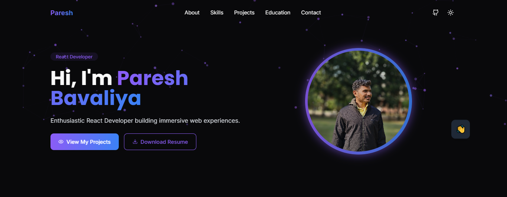
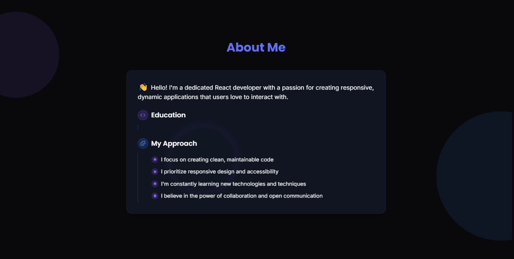
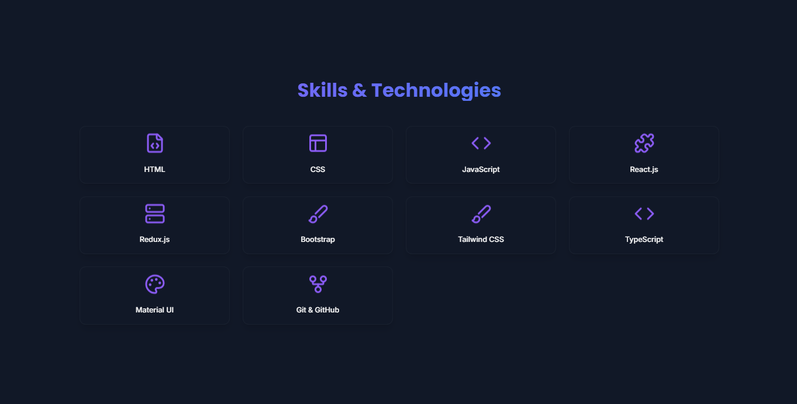
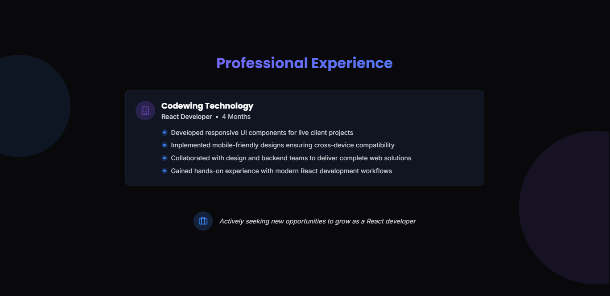
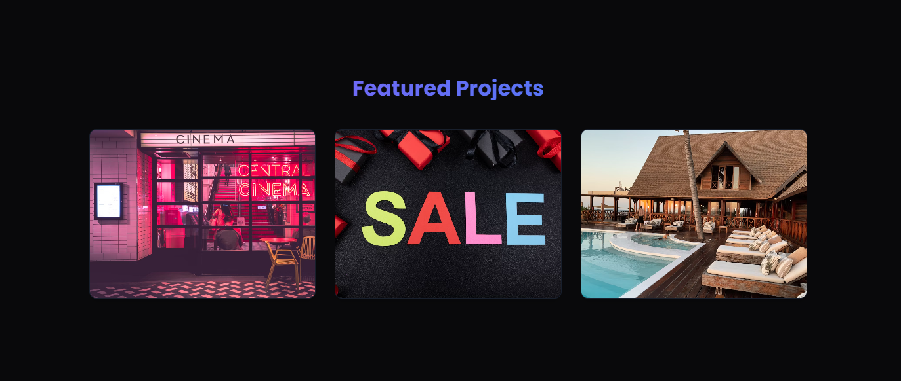
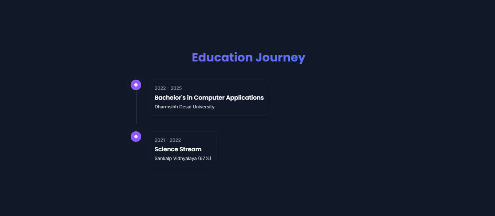
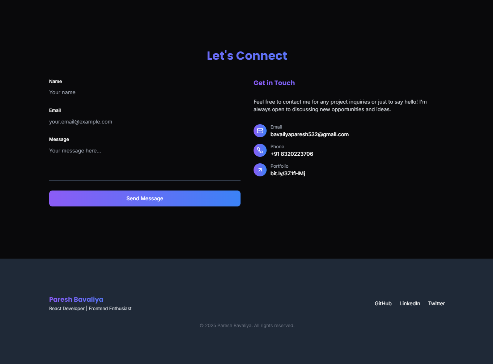

# Portfolio Website

A modern and responsive portfolio website built to showcase personal projects, skills, and professional experience. It includes several sections to highlight key information effectively.

## What Technologies Are Used for This Project?

This project is built with:

- **Vite**: For fast development and build process.
- **TypeScript**: To ensure type safety and better code maintainability.
- **React**: As the core library for building the user interface.
- **shadcn-ui**: For pre-designed, accessible UI components.
- **Tailwind CSS**: For utility-first and customizable styling.
- **JavaScript**: For additional dynamic behavior.

## How to Run This Code?

1. Clone the repository:

   ```bash
   git clone <repository-url>
   ```

2. Navigate to the project directory:

   ```bash
   cd portfolio
   ```

3. Install dependencies:

   ```bash
   npm install
   ```

4. Start the development server:

   ```bash
   npm run dev
   ```

5. Open the app in your browser at [http://localhost:3000](http://localhost:3000).

## Folder Structure

```
portfolio/
├── node_modules/
├── public/
├── src/
│   ├── components/
│   ├── hooks/
│   ├── lib/
│   ├── pages/
│   ├── App.css
│   ├── App.jsx
│   ├── index.css
│   ├── main.jsx
├── .gitignore
├── bun.lockb
├── components.json
├── eslint.config.js
├── index.html
├── package-lock.json
├── package.json
├── postcss.config.js
├── README.md
├── tailwind.config.ts
├── tsconfig.app.json
├── tsconfig.json
├── tsconfig.node.json
├── vite.config.ts
```

## Website Sections with Screenshots

### 1. Home Section

The landing section of the portfolio with a welcoming introduction.



### 2. About Section

Details about personal background and journey.



### 3. Skills & Technologies Section

A showcase of technical skills and technologies used.



### 4. Experience Section

An overview of professional experience and roles.



### 5. Projects Section

Featured projects with descriptions and links.



### 6. Education Section

Academic qualifications and certifications.



### 7. Contact Us Section

Contact form and social media links for easy communication.



## License

This project is licensed under the MIT License.

---
